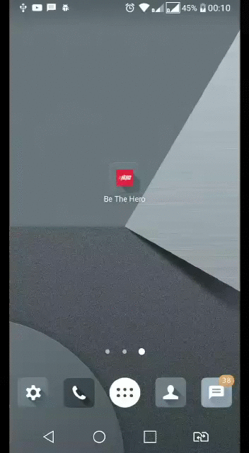

<h1 align="center">Be The Hero - Mobile</h1>

  
  

  Seja um herói com o Be The Hero. Um projeto que visa conectar pessoas que desejam fazer contribuições monetárias a ONG's, instituições, ou até pessoas que precisam de ajuda....

  

    <a aria-label="Matheus" href="https://github.com/matheusmaximianomv">
      </img>
    </a>
    <a aria-label="Native" href="https://reactnative.dev/">
      </img>
    </a>
    <a aria-label="react-native-cli" href="https://github.com/react-native-community/cli">
      </img>
    </a>
  

## Apresentação

Aplicação desenvolvida na 11º Semana Omnistack da Rocketseat, o módulo mobile permite que as pessoas vejam todos os casos inscritos na aplicação, entrar em contato pelo email ou whatsapp, com as ONG's, instituições ou pessoas físicas tudo isso pelo aplicativo Be The Hero. O app foi desenvolvido com a CLI do React Native, ao invés do EXPO como apresentado nas aulas. Além das tecnologias apresentadas durantes as aulas foram utilizadas outras para auxiliar no desenvolvimento e fixar conteúdos relativos. <strong>OBS: Os gifs podem demorar um pouco a começar</strong>  

<h4 align="center">Início da Aplicação e Listagem de Casos</h4>

  

 
<h4 align="center">Detalhes de um caso e métodos de comunicação</h4>

  

## Tecnologias
* React Native&nbsp;&nbsp;&nbsp;&nbsp;
* React Native CLI&nbsp;&nbsp;&nbsp;
* React Navigation&nbsp;&nbsp;&nbsp;
* Axios&nbsp;&nbsp;&nbsp;
* Intl&nbsp;&nbsp;&nbsp;
* Query String&nbsp;&nbsp;&nbsp;
* Prop-Types&nbsp;&nbsp;&nbsp;
* React Native Vector Icons&nbsp;&nbsp;&nbsp;
* Reactotron React Native&nbsp;&nbsp;&nbsp;
* Styled-Components&nbsp;&nbsp;&nbsp;
* ESlint&nbsp;&nbsp;&nbsp;
* Prettier&nbsp;&nbsp;&nbsp;

## Executando o Projeto
Após realizar as devidas configurações de ambiente em seu computador ou no seu dispositivo móvel, para projetos react-native, abra o terminal e execute os seguintes comandos:
1. Clone o projeto: `git clone https://github.com/matheusmaximianomv/beTheHero`
2. Entre na pasta: `cd beTheHero/mobile`
3. Instale as dependências:
 Usando NPM `npm install`
 Usando o Yarn `yarn`
4. Execute o Metro Bundler `react-native run start`
5. Execute o projeto no emulador ou no dispostivo via depuração USB:
 Android: `react-native run-android`
 IOS: `react-native run-ios`

## Contribua

1. Fork it (https://github.com/matheusmaximiano/beTheHero/fork)
2. Crie uma branch de feature (git checkout -b feature/algumacoisa)
3. Commit suas alterações (git commit -m 'Tipo: Modificação')
4. Dê o push para a nova branch (git push origin feature/algumacoisa)
5. Crie uma nova Pull Request
